# typing_game

단어가 나타나면 처리하여 점수를 얻는 게임. Java의 Swing을 이용하여 개발.

# 개요

게임 시작 시 적들이 오른쪽에서 왼쪽으로 밀려오며 적을 처리(단어를 타이핑)하면 10점을 획득하고 잘못된 단어를 입력할 때마다 5점이 감점된다. 특별한 적이 존재하는데 이 적을 제거시 죽은 위치 주변에 3개의 일반 적이 생성된다. 이외에도 제거될 때 적들을 5초 동안 멈추게 하거나 랜덤으로 적 3개를 같이 제거하는 아이템 적이 존재한다.  
게임 레벨은 총 5단계이다. 적은 일정한 간격으로 랜덤한 단어가 선택되어 생성된다. 단계가 올라갈수록 특별한 적과 아이템 적의 개수가 하나씩 증가한다. 모든 적들은 1픽셀씩 움직이며 단계가 올라갈 수록 움직임 지연시간이 짧아진다. 즉 적의 움직임 속도가 빨라진다.  
게임에서 생명은 3개인 상태로 시작되며 단계를 해결해도 그대로 유지된다. 생명이 모두 소모되면 게임은 종료되고 플레이어에게 저장할 이름을 물어본다. 그 후 기록을 저장한다.  
초기 화면에서는 게임 시작, 기록, 단어 편집 버튼이 존재한다. 기록 화면에서는 점수, 해결한 단계, 이름 순으로 순위가 결정된 목록이 보인다. 단어 편집 화면에서는 단어를 추가 및 삭제가 가능하다.

# 구조도

- 게임 캐릭터 상속 구조도

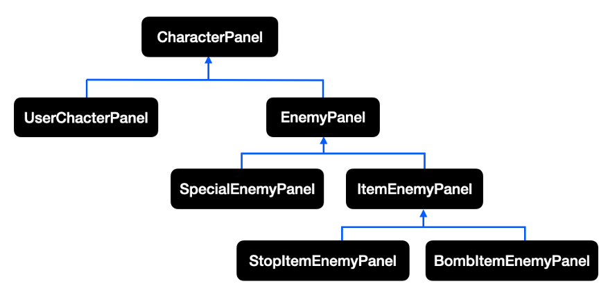

- 주요 클래스 구조도

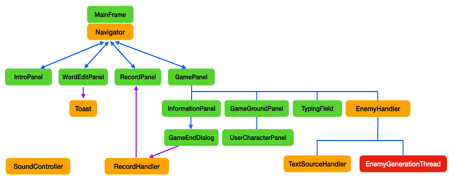

# 스크린샷

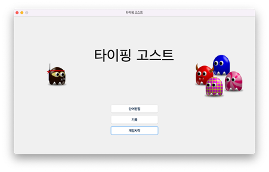

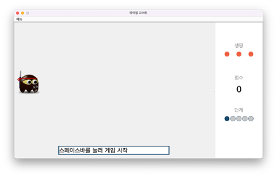

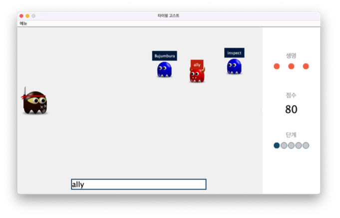

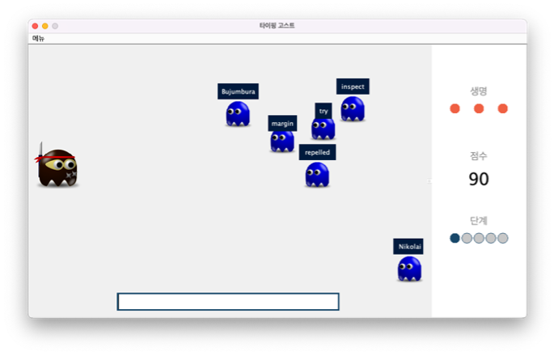

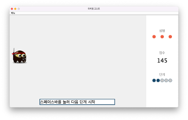

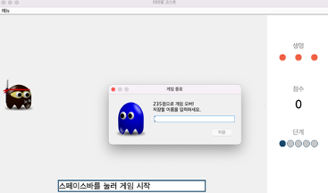

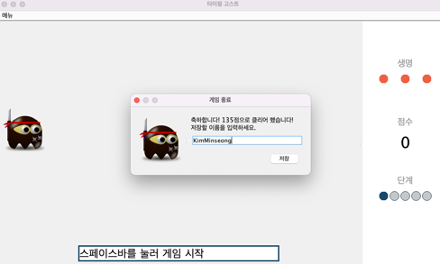

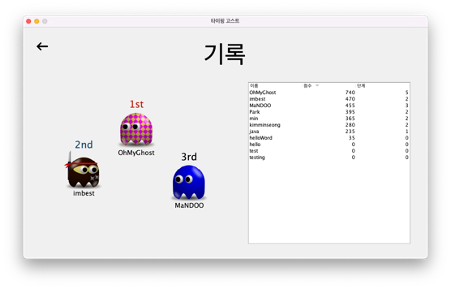

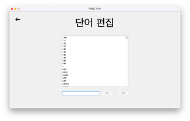
